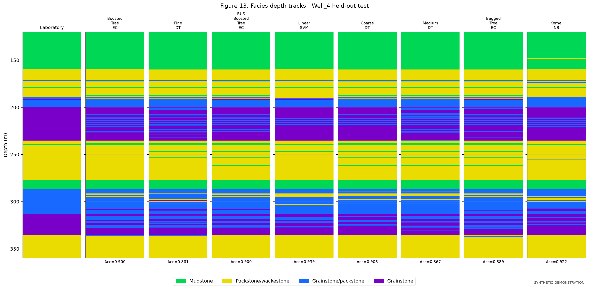
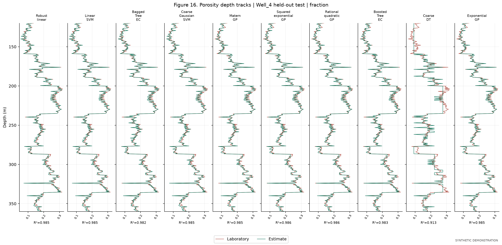
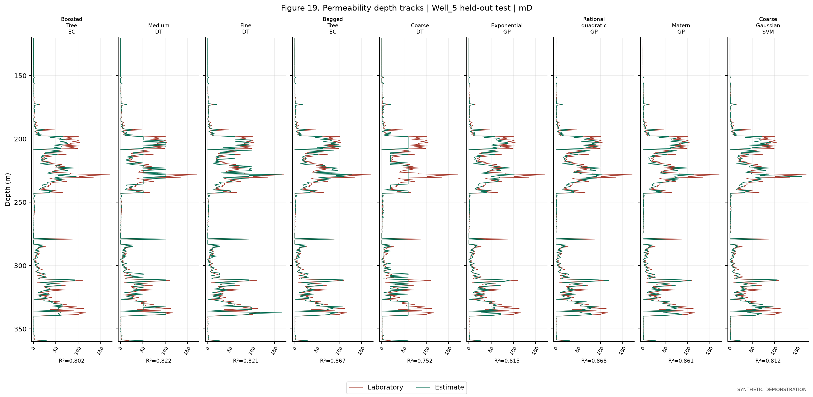

# Well logs and laboratory data

## What is this repository for?

This Python project generates synthetic well logs and laboratory measurements
for five carbonate wells and compares models for predicting facies, porosity
and permeability. **Wells 1–3 are used for model development and training;
Wells 4–5 are held out for testing.**

The code generates 19 manuscript figure types and 14 supplementary plots.
All data and results are synthetic. Figures 1–2 are conceptual geological
schematics; the other figures are computed from generated data and predictions.
These results do not reproduce original field measurements or published scores.

The repository contains individual Python source files, a runnable quick example,
and documentation. No compressed source archive is required.

## Installation

Use **Python 3.11 or 3.12**. Download this repository using **Code → Download ZIP**
and extract it, or clone it:

```bash
git clone https://github.com/saadallahham/multi-model.git
cd multi-model
```

GitHub's Download ZIP button packages the individual files for downloading;
the repository itself stores the files separately.

From a terminal in the project folder, install the dependencies:

```bash
python -m pip install -r requirements.txt
```

For Spyder, install into the Python environment used by its IPython console:

```python
import sys
import subprocess
subprocess.check_call([
    sys.executable, "-m", "pip", "install", "-r",
    r"C:\path\to\multi-model-main\requirements.txt"
])
```

Replace the example path with your project folder and restart the Spyder kernel
after installation. Keep the Python files together. No manuscript, credentials
or external dataset is required.

## Run the quick test

After installing the requirements, run:

```bash
python quick_test.py
```

In Spyder, open **quick_test.py** and run the entire file with F5.
The test generates 120 samples per well, trains three example models on
Wells 1–3, predicts Wells 4–5, and checks that saving and reloading the models
preserves predictions. It uses temporary files and does not overwrite results.
A successful run ends with:

```text
PASS: 5 synthetic wells; 3 training wells; 2 held-out test wells; 3 models; 240 test rows; saved-model predictions verified.
```

This is a software check, not a claim of predictive accuracy on real wells.

## Run the complete experiment

**In Spyder:** open **spyder_run_all.py**, edit the settings at the top if desired,
and run the entire file with F5. It generates data, trains models, computes test
scores, saves figures and opens a local HTML gallery. DataFrames remain available
in Variable Explorer. Results go to `outputs_spyder/` beside the script.

**In a terminal:** run:

```bash
python run_experiment.py
```

Terminal results go to `outputs/` by default. For the same folder as Spyder:

```bash
python run_experiment.py --output outputs_spyder
```

Default settings are 360 samples per well (1,800 total), seed 42, and a 240-row
training cap for Gaussian processes. The corresponding Spyder settings are
`SAMPLES_PER_WELL`, `RANDOM_SEED`, `GP_MAX_TRAINING_ROWS`, and `OUTPUT_FOLDER`.
Use at least 120 samples per well and a GP cap of at least 40. Reusing the output
folder replaces generated results; choose a new folder to retain separate runs.

## Where are the generated data and figures?

Within your chosen output folder:

| Location | Contents |
|---|---|
| `data/Well_1_logs.csv` through `data/Well_5_logs.csv` | Synthetic logs for each well |
| `data/Well_1_laboratory.csv` through `data/Well_5_laboratory.csv` | Synthetic facies, porosity and permeability |
| `data/development.csv` | Combined training/development data for Wells 1–3 |
| `data/application_logs.csv` | Test logs for Wells 4–5 |
| `data/application_truth_for_evaluation_only.csv` | Test laboratory reference values |
| `manuscript_figures/` | 19 numbered figures in PNG/PDF and an HTML gallery |
| `figures/` | 14 supplementary figures in PNG/PDF |
| `metrics.csv` | Computed scores for every evaluated model and well |
| `application_predictions.csv` | Selected-model predictions for test wells |
| `models/` | Three selected fitted models |

Open `manuscript_figures/index.html` locally to browse the gallery. The scripts
save plots to files rather than opening many windows in Spyder. Generated data
and fitted models are created when you run the experiment; this source package
includes only the sample results documented below.

## Results

The following scores come from the complete demonstration run with seed 42,
360 samples per well and GP cap 240, using scikit-learn 1.7.2. Models were selected
only through leave-one-well-out validation within Wells 1–3, then refitted on
those three wells. The table reports **held-out test results**.

| Target | Test well | Selected model | Accuracy | Macro-F1 | R² | MAE |
|---|---|---|---:|---:|---:|---:|
| Facies | Well_4 | Linear discriminant analysis | 0.9250 | 0.9097 | — | — |
| Facies | Well_5 | Linear discriminant analysis | 0.9667 | 0.9623 | — | — |
| Porosity | Well_4 | Linear regression | — | — | 0.9851 | 0.00657419 |
| Porosity | Well_5 | Linear regression | — | — | 0.9881 | 0.00598447 |
| Permeability | Well_4 | Coarse Gaussian SVR | — | — | 0.7426 | 4.90984 |
| Permeability | Well_5 | Coarse Gaussian SVR | — | — | 0.8120 | 5.61821 |

Porosity MAE is in fraction units; permeability MAE is in mD. Facies is categorical,
so accuracy and macro-F1 are reported instead of R² on arbitrary class codes.
The smaller quick test produces different scores. These figures describe this
synthetic run and do not establish performance on real reservoirs.

Supporting files: [all model metrics](docs/results/metrics.csv),
[selected models](docs/results/selected_models.json), and
[run settings](docs/results/run_manifest.json).

### Facies predictions for held-out Well_4



### Porosity predictions for held-out Well_4



### Permeability predictions for held-out Well_5



The displayed tracks compare multiple models; the table above reports the
selected model for each target. See [FIGURE_GUIDE.md](FIGURE_GUIDE.md) for all
19 figure types, model variants and differences from the manuscript.

## Redraw figures without training again

After a complete run, open `spyder_redraw_figures.py` in Spyder, set its output
folder to your existing results, and run it. Alternatively:

```bash
python manuscript_figures.py --output outputs_spyder
```

## Predict from another CSV of well logs

After training, edit `INPUT_CSV`, `MODEL_FOLDER` and `OUTPUT_CSV` in
`spyder_predict_logs.py`, then run it in Spyder. Alternatively:

```bash
python apply_models.py --input my_logs.csv --models outputs_spyder/models --output my_predictions.csv
```

Required columns are:

| Column | Unit or meaning |
|---|---|
| `Well` | Well identifier |
| `Depth_m` | Depth in meters; each well/depth pair must be unique |
| `DT` | Sonic transit time, microseconds per foot |
| `GR` | Gamma ray, API |
| `NPHI` | Neutron porosity, fraction |
| `RHOB` | Bulk density, g/cm³ |
| `LogRT` | log10 of resistivity in ohm·m |

Laboratory targets are not required for prediction. For positive resistivity,
use `LogRT = np.log10(RT_ohm_m)`. Missing predictors can be NaN and are imputed
using fitted training medians. Laboratory porosity is a fraction and permeability
is mD. Facies codes are 0=mudstone, 1=packstone/wackestone,
2=grainstone/packstone, 3=grainstone.

The included workflow trains on synthetic data and is not calibrated for field
applications. Using real laboratory data requires adapting training and depth
matching; the prediction script does not retrain models. Load only trusted
joblib files.

## Source files

| File | Purpose |
|---|---|
| `quick_test.py` | Small runnable example and prediction verification |
| `spyder_run_all.py` | Complete workflow in Spyder |
| `spyder_redraw_figures.py` | Regenerate numbered figures |
| `spyder_predict_logs.py` | Apply models to another CSV |
| `synthetic_data.py` | Synthetic logs and laboratory data generator |
| `models.py` | Model definitions and preprocessing |
| `run_experiment.py` | Validation, model selection, training and evaluation |
| `apply_models.py` | Apply saved models from the terminal |
| `plots.py` | Supplementary plotting functions |
| `manuscript_figures.py` | Numbered figures and HTML gallery |
| `tests/test_workflow.py` | Additional verification tests |

The registry contains 25 classifiers and 25 regressors for each of two continuous
targets. Preprocessing is fitted within training folds. Permeability is learned
in log10 space and evaluated in mD. No test-well labels are used for selection.

## Full verification

From the project folder, using the installed Python environment:

```bash
python run_experiment.py
python apply_models.py
python -m unittest discover -s tests -v
```

Run these in order because the integration checks use the default `outputs/`
folder. The included GitHub Actions workflow also runs the quick test and the
complete workflow on Linux and Windows.

## Troubleshooting

- **Missing Python package:** install `requirements.txt` in the interpreter used
  by Spyder, then restart the kernel.
- **Missing data or models:** run the complete experiment first and check the
  output-folder setting.
- **No figures in Spyder's Plots pane:** open the saved PNG/PDF files or HTML gallery.
- **Different output locations:** Spyder defaults to `outputs_spyder/`; the
  command-line experiment defaults to `outputs/`.
